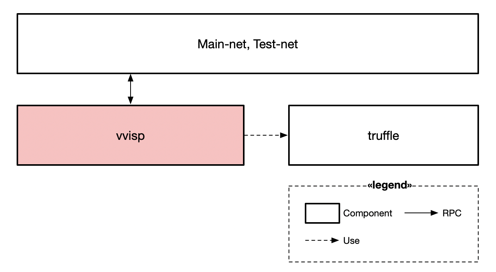
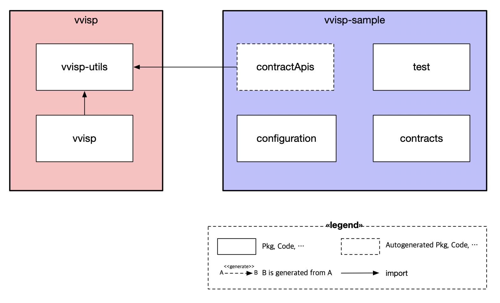

# vvisp

English version: [README.md](./README.md)

[](https://circleci.com/gh/HAECHI-LABS/vvisp)
[](https://coveralls.io/github/HAECHI-LABS/vvisp?branch=dev)
[](https://github.com/RichardLitt/standard-readme)
[](https://conventionalcommits.org)
[](https://lernajs.io/)

> vvisp은 EVM 기반 블록체인에서 가장 사용하기 쉬운 스마트 컨트랙트 개발 CLI 도구이자 프레임워크입니다. 

**단 한 줄의 명령어로 쉽고 빠른 스마트 컨트랙트 배포와 실행**

<p align="center"></p>

### Key Benefits
 - 블록체인 서비스 개발 환경 개선
 - 블록체인 서비스 개발 및 운영 시간 단축
 - 블록체인이 익숙하지 않은 전세계 개발자들의 러닝커브 단축

## Table of Contents

- [Description](#description)
- [Install](#install)
- [Usage](#usage)
- [Commands](#commands)
- [Contributing](#contributing)
- [Architecture](#architecture)
- [Contact](#contact)
- [License](#license)

## Description
**블록체인이 익숙하지 않은 개발자들도 쉽게 사용할 수 있는 CLI 도구**

: 블록체인의 스마트 컨트랙트는 기존에 없던 생소한 개발 분야입니다.
그만큼 개발자에게 DApp 개발은 익숙하지 않은 부분이 많습니다.
여러 레퍼런스를 참고하여 컨트랙트를 작성하였다해도 이를 어떻게 배포하는지, 어떻게 사용해야하는지에 대한 장벽이 존재합니다.
`vvisp`은 이러한 불편함을 줄이고자 만든 CLI(Command Line Interface) 도구입니다.

**(1) 명령어 한줄로 컨트랙트 배포하기**

: 스마트 컨트랙트를 블록체인에 배포하는 것은 개발자들에게 낯선 과정입니다.
컨트랙트를 배포하기 위해서는 스마트 컨트랙트를 작성하는 것 뿐만 아니라 스마트 컨트랙트 배포 코드를 직접 작성해야만 합니다.
또한 DApp을 구성하는 여러 개의 스마트 컨트랙트를 배포하기 위해 개발자는 배포 순서 역시 고려해야 했습니다.
`vvisp`은 단순한 설정 파일 형태로 배포 대상들을 간단히 정의하고, 명령어 한줄로 코드 작성 없이 배포 순서를 고려하여 컨트랙트를 배포합니다.

**(2) 명령어 한줄로 컨트랙트 기능 실행하기**

: 기존에는 어떤 컨트랙트의 기능을 실행하기 위해서 라이브러리를 공부하고, 함수를 호출하고, 함수 호출 코드를 수동으로 작성해야 했습니다.
이는 스마트 컨트랙트 개발에 익숙하지 않은 개발자들에게 큰 진입장벽으로 작용합니다.
그러나 `vvisp`은 일련의 작업들 없이 명령어 한줄을 통해 컨트랙트의 특정 기능을 실행하고, 결과를 받아올 수 있도록 설계되었습니다.

**(3) Upgradeable Smart Contract Framework 지원**

: 추가적으로 `vvisp`은 USCF(Upgradeable Smart Contract Framework)을 지원합니다.
개발자들이 업그레이드 가능한 스마트 컨트랙트에 대한 깊은 지식이 없더라도, 비습은 내장되어있는 업그레이드 가능한 라이브러리를 지원하여 개발자가 ‘업그레이드’하는 기능을 쉽게 사용할 수 있습니다.
USCF에 대한 추가적인 정보가 필요하시다면 HAECHI-LABS의 [pdf file](https://drive.google.com/file/d/1H9gtmpiZ5zwIFwgHGOOvz9Oa8SAlpM5h/view?usp=sharing)을 참고하시기 바랍니다.

| **Contributors**: Please see the [Contributing](#contributing) section of this README. |
| --- |

## Install

[Node.js](http://nodejs.org/)가 설치되어야 합니다.
이후, [npm](https://npmjs.com/)를 설치하신 후
```sh
$ npm install --global @haechi-labs/vvisp
```
을 실행하거나 [yarn](https://yarnpkg.com)을 설치 후
```sh
$ yarn global add @haechi-labs/vvisp
```
을 실행하여 주세요.

## Usage

`vvisp`을 사용한 예제 프로젝트를 참고하시려면 [이곳](https://github.com/HAECHI-LABS/vvisp-sample)을 참고해주세요.

**1. 프로젝트 생성**
```sh
$ mkdir my-project
$ cd my-project
$ vvisp init
$ npm install #or yarn install
```
`` $ npm init `` 혹은 ``$ truffle init``을 실행하지 않아도 됩니다.
`vvisp`은 [truffle](https://truffleframework.com/truffle)을 지원하는 환경을 설정해주며 `package.json`을 자동 생성합니다.

``$ vvisp init``에 대한 자세한 정보는 _[이곳](./packages/vvisp/commands/README-ko.md#init)_ 을 참고하시기 바랍니다.

**2. `contracts/` 폴더에 컨트랙트를 생성 및 작성**

이제, `gen-script`, `compile` 그리고 `flatten` 명령어를 사용할 수 있습니다.

**3. `vvisp-config.js` 설정**

`vvisp-config.js`에 환경 변수들을 설정해 주세요.
`vvisp-config.js`에 대한 자세한 정보는 [이곳](./CONFIGURATION-ko.md#config)을 참고해 주세요.
이제 `deploy-contract` 명령어를 사용할 수 있습니다.

**4. `service.vvisp.json` 작성**

배포할 DApp 서비스의 컨트랙트에 대한 정보를 `service.vvisp.json`에 작성해주세요.
`service.vvisp.json`에 대한 자세한 정보는 [이곳](./CONFIGURATION-ko.md#service)을 참고해 주세요.
이제 `deploy-service` 명령어를 사용할 수 있습니다.

[CONFIGURATION-ko.md](./CONFIGURATION-ko.md)에서 환경 설정에 대한 자세한 내용을 참고하세요.

`$ vvisp --help`을 실행하여 `vvisp`에서 사용되는 기능들을 참고해주세요.

## Commands

명령어와 연결된 문서를 참고바랍니다:
- [init](./packages/vvisp/commands/README-ko.md#init): 프로젝트를 생성합니다.
- [compile](./packages/vvisp/commands/README-ko.md#compile): 컨트랙트 파일들을 컴파일합니다.
- [deploy-contract](./packages/vvisp/commands/README-ko.md#deploy-contract): 컨트랙트를 배포합니다.
- [deploy-service](./packages/vvisp/commands/README-ko.md#deploy-service): 컨트랙트로 이루어진 서비스를 배포합니다.
- [gen-script](./packages/vvisp/commands/README-ko.md#gen-script): 스마트 컨트랙트와 통신할 수 있는 자바스크립트 api들을 생성합니다.
- [console](./packages/vvisp/commands/README-ko.md#console): 컨트랙트와 상호작용할 수 있는 콘솔 환경을 제공합니다.
- [flatten](./packages/vvisp/commands/README-ko.md#flatten): 여러 컨트랙트 파일을 하나로 합칩니다.


## Architecture

<p align="center"></p>

`vvisp`은 rpc를 통해 main-net, test-net과 통신하며, 유저의 현 버전 DApp 서비스를 배포, 업그레이드, 테스트, 컴파일 등을 돕습니다.
`vvisp`은 truffle test framework를 지원합니다.


<p align="center"></p>

- vvisp

  vvisp은 크게 vvisp-utils, vvisp and vvisp-contracts으로 이루어져 있습니다.

  - vvisp-utils

    vvisp-utils 은 vvisp 과 vvisp-sample에서 사용하는 유용한 기능들을 제공합니다.

  - vvisp

    vvisp의 핵심 로직입니다.

  - vvisp-contracts

    vvisp-contracts는 업그레이드 가능한 스마트 컨트랙트 개발을 위한 컨트랙트 라이브러리입니다.

- vvisp-sample

  vvisp-sample은 `vvisp init` 명령어로 생성된 boilerplate 패키지입니다.

  - contractApis

    `vvisp gen-script` 명령어를 통해 자동 생성된 자바스크립트 라이브러리로 배포된 프로젝트를 쉽게 사용하게 돕습니다.

  - configuration

    `vvsip`의 프로젝트에는 `vvisp-config.js`, `service.vvisp.json`, `state.vvisp.json`와 같은 설정파일들입니다.

  - test

    유저가 작성한 컨트랙트 테스트 코드들이 존재할 디렉토리입니다.

  - contracts

    contracts 폴더 내에는 `vvisp init`를 통해 생성된 registry 파일이 포함되어 있으며 이곳에서 컨트랙트들이 작성됩니다.


## Contributing

프로젝트 참여를 고려해주셔서 감사합니다!
해당 프로젝트는 모든 분들께 열려있습니다 :)

*프로젝트에서 사용되는 큰 브랜치입니다:*
- `master`: 배포된 안정적인 버전
- `dev`: 안정적인 버전을 위해 작업할 브랜치

기여를 위해 [CONTRIBUTING-ko.md](./CONTRIBUTING-ko.md)를 참고해 주시면 감사하겠습니다.

## Contact 

- General Contact: hello@haechi.io
- [Facebook](https://www.facebook.com/HAECHILABS/)
- [Medium](https://medium.com/haechi-labs)

## License

MIT
